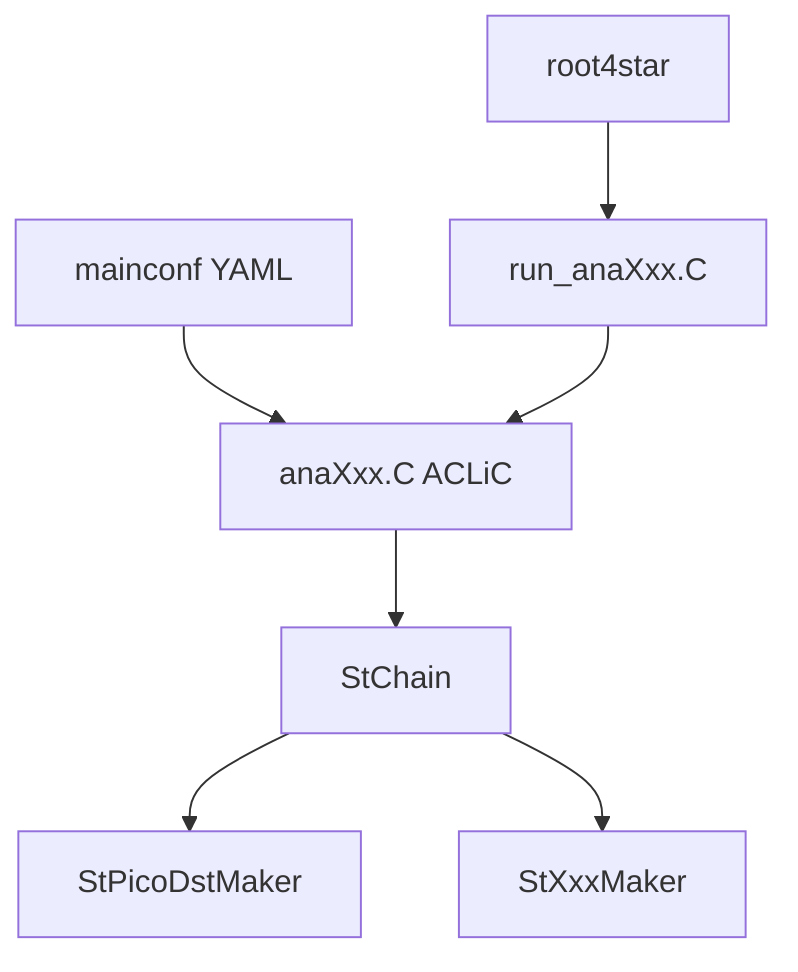

# STAR analysis framework

This repository is a **PicoDst analysis framework** for STAR. It follows the **StChain / StMaker** pattern: a ROOT macro builds a chain and drives `Init` → `Make(i)` → `Finish`, while physics, histograms, and cut-driven logic live in **compiled Makers** (`lib/libStXXXMaker.so`). **YAML mainconf** files (`config/mainconf/main_<anaName>.yaml`) are the single entry point for configuration; `script/setup.sh` and batch joblists use the same metadata via **analysis_info**. You can run locally with `root4star` or submit **star-submit** jobs using generated XML under `job/joblist/`.

## At a glance

**In short:** mainconf is loaded in the compiled analysis macro; `run_anaXxx.C` loads libraries and builds `anaXxx.C+`; the chain reads PicoDst and runs your Maker. **Why two macros?** See [PHILOSOPHY.md](PHILOSOPHY.md).

## Documentation

| Document | Purpose |
|----------|---------|
| [INSTALL.md](INSTALL.md) | First-time setup: clone, submodule, directories, analysis_info, build, local run (and optional batch). |
| [PHILOSOPHY.md](PHILOSOPHY.md) | Design principles, reproducibility, two-macro rationale; **source of truth** for agents and contributors. |
| [docs/ai/README.md](docs/ai/README.md) | AI guidance map. Includes `AGENT_RULES.md`, task skills, and migration policy. |
| [CLAUDE.md](CLAUDE.md) | Antigravity / Claude Code entrypoint. Points to shared source-of-truth docs. |
| [docs/REFERENCE.md](docs/REFERENCE.md) | Full reference: prerequisites, analysis_info tables, how to run, batch, QA scripts, adding an analysis, config, joblists. |
| [job/run/README.md](job/run/README.md) | Submit, `configlog`, cleaning up `job/run/`. |

Only **template/sample** content under `config/` and `job/joblist/` is tracked in git; built `.so` files under `lib/` are git-ignored.

## Repository layout (short)

| Path | Role |
|------|------|
| **analysis/** | `run_anaXxx.C` (runner) + `anaXxx.C` (chain; ACLiC). One pair per analysis. |
| **config/** | `mainconf/`, `cuts/`, `maker/`, `hist/`, `analysis/` (analysis_info), `picoDstList/`. |
| **StMaker/** | Maker sources → `lib/libStXXXMaker.so`. |
| **script/** | `setup.sh`, `run_ana*.sh`, `generate_joblist.sh`, helpers. |
| **job/** | `joblist/` templates; `job/run/` for submit and logs. |
| **include/** / **src/** | Framework (`ConfigManager`, cuts, yaml-cpp build). |

See [docs/REFERENCE.md](docs/REFERENCE.md) for a longer directory table and script list.

## Development with Cursor (optional)

Open this repository as the **project folder** in [Cursor](https://cursor.com/). Canonical AI guidance lives in [docs/ai/README.md](docs/ai/README.md) and [PHILOSOPHY.md](PHILOSOPHY.md). [.cursor/rules/](.cursor/rules/) and [.cursor/skills/](.cursor/skills/) are lightweight wrappers for Cursor integration.

When a skill source under `docs/ai/skills/*.md` is edited in Cursor, `.cursor/hooks.json` triggers `.cursor/hooks/auto-sync-skills.sh`, which runs `script/sync_and_check_skills.sh` automatically.
